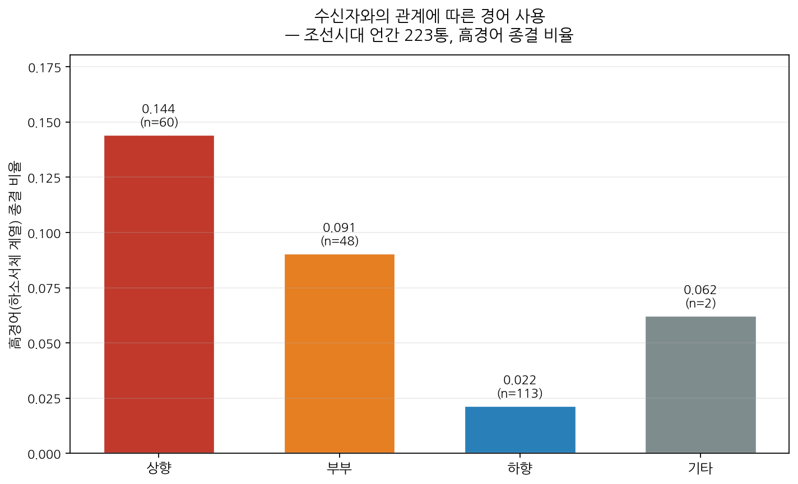

# K-Story Persona Lab

> 공공 문화데이터로 **한국 역사 인물의 말투·페르소나를 데이터로 정량화**하는 분석 프로젝트.
> 제4회 문화체육관광 AI·데이터 활용 공모전(데이터분석 부문) 출품작.

## 핵심 발견 — 말투는 '누구에게 쓰는가'로 결정된다

조선시대 언간(한글편지) **223통**을 분석한 결과, 발신자의 말투(특히 경어)는
**수신자와의 관계 방향**에 따라 체계적으로 달라진다.

| 관계 방향 | 편지 수 | 高경어 종결 비율 |
|---|---|---|
| **상향** (손아래→손위) | 60 | **0.144** |
| 부부 | 48 | 0.091 |
| **하향** (손위→손아래) | 113 | **0.022** |

→ 손위에게 쓸 때 손아래에게 쓸 때보다 **약 6.5배** 더 정중. 통계적으로 유의
(**Kruskal-Wallis H=61.1, p=5.5e-14**).

**두 가지 더:**
- **주체높임(-시-)은 관계와 무관하게 평평** → *누구를 높이느냐(주체)* 와 *누구에게 쓰느냐(청자)* 는
  분리된 축. 단순 "높임말 많다/적다"가 아니다.
- **같은 사람도 상대에 따라 말투를 바꾼다**(within-person). 예: 안동권씨는 며느리로서 高경어 0.40,
  장모로서 0.025. 송기연은 조카·아들로서 0.18~0.25, 어른 역할일 땐 0.



상세: [`reports/relationship_analysis.md`](reports/relationship_analysis.md)

## 콘텐츠적 함의 (활용성)
역사 인물 캐릭터의 '말투'는 고정값이 아니라 **상대와의 관계 함수**로 설계해야 사실적이다.
본 분석은 '관계 → 경어 수준' 매핑을 데이터로 제공 → 사극·교육·캐릭터 설정의 정량 근거.

## 분석 파이프라인
```
data/raw/*.xml (언간)
  ↓ src/analysis/relationship_style.py   letter 단위 파싱 + 관계 방향 분류 + 경어 피처
  ↓ scripts/run_relationship_analysis.py 관계별 경어 + within-person + 군집 + 차트/리포트
results/ + reports/

(보조) src/data/load_historical.py → src/features/stylometry.py(17 피처) → src/cluster (문서 군집)
```

## 빠른 실행
```bash
python3 -m venv .venv && source .venv/bin/activate
pip install -r requirements.txt
python tests/test_smoke.py                                  # 샘플로 파이프라인 검증
python scripts/run_relationship_analysis.py data/raw        # 핵심: 관계 기반 분석
python -m src.pipeline --data data/raw                      # 보조: 문서 군집
```

## 데이터
말뭉치 원본은 국립국어원 이용 약정상 커밋하지 않음 (`data/raw/` git-ignored).
다운로드: `python scripts/download_corpus.py hist2024` (API 키는 `corpus_keys.json`, git-ignored).

| 말뭉치 | 역할 | 상태 |
|---|---|---|
| 국어 역사 자료 말뭉치 2024 | 핵심 (언간) | ✅ 분석 완료 (관계 발견) |
| 국어 역사 자료 말뭉치 2023 | 고소설·구비문학 | ⏳ 선택 확장 (로컬 Code) |
| 일상 대화 말뭉치 2024 | 현대 대조군 | ⏳ 선택 확장 (로컬 Code) |

## 작성자
GitHub [@kimble125](https://github.com/kimble125) · Blog: forrest125.tistory.com

## 라이선스
코드 MIT. 말뭉치 데이터는 국립국어원 이용 약정을 따름.
